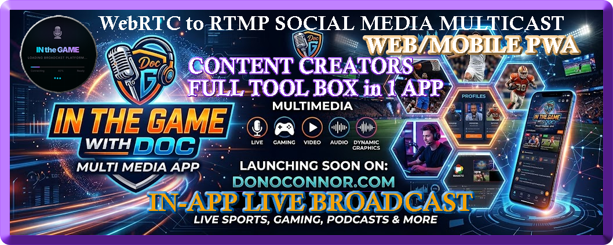
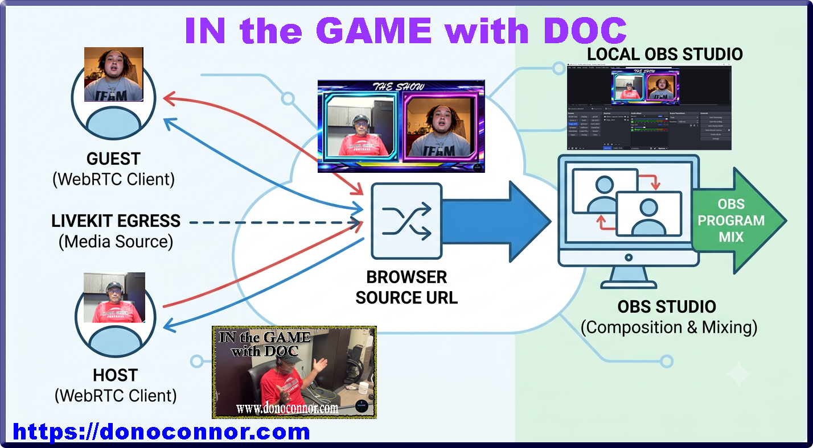

# MediaSite — Live Broadcasting & Guest Management Platform

[](LICENSE)
[](https://livekit.io)
[](https://www.djangoproject.com)
[](https://nextjs.org)
[](https://www.postgresql.org)
[](https://redis.io)

> **The all-in-one production studio for live streaming.**

<p align="center">
  
</p>
<p align="center">
  <em>Main Logo Image for ITG with DOC Media App. Which runs as a full PWA App, and works on all mobile devices.</em>
</p>
Check out the live PWA Media App here! (https://donoconnor.com)

---

## What is MediaSite?

MediaSite is a complete live broadcasting platform. Host a show, bring in remote guests via their browser (no installs), manage a guest queue, push your stream to YouTube / Facebook / TikTok simultaneously — all from one central **Dashboard**. Viewers can watch live on the **Broadcast Page**. Built for podcasters, sports shows, radio hosts, and content creators.

### See it in action

<!-- TODO: Add video link -->
*Demo video coming soon — we'll show a full broadcast from guest join to multi-platform simulcast.*

---

## ✨ Highlights

| 🎙️ Host & Guest Broadcasting | 📡 Multi-Platform Simulcast | 📅 Show Calendar & Blog |
|---|---|---|
| **Host** uses OBS Studio (or any tool with a browser source) to capture the composed stream | Push to YouTube, Facebook, and TikTok all at once | Schedule shows, assign guests, publish episodes |
| **Guests** join via browser on desktop or mobile — no software install needed (full PWA) | Per-platform RTMP with auto-reconnect | Built-in blog with categories, comments, featured posts |
| Director-controlled guest queue + auto picture-in-picture | Stream health monitoring | Public archive of past shows |

| 👤 Roles & Profiles | 🤖 AI Assistant | 🔒 Security |
|---|---|---|
| `host` · `guest` · `athlete` · `staff` · `admin` | Avatar agent greets & preps guests before air | COPPA age gate & parental consent |
| Bio, photos, social links, sport stats | Site-wide FAQ chatbot with conversation memory | Turnstile CAPTCHA, email verification |
| Optional Sports Module — drills, measurables, leaderboards | Powered by Ollama + local LLMs | JWT auth, rate limiting, admin IP whitelist |

---

## 🏗️ How it works

```
┌──────────────┐     ┌──────────────────────────────────────────────┐
│    User      │     │               Your Server                     │
│              │     │                                               │
│  Browser ────┼────▶│  Nginx (443)                                 │
│  (Viewer)    │     │    │                                          │
│              │     │    ├──▶ Next.js (3000)  — Frontend UI         │
│  OBS Studio──┼──┐  │    ├──▶ Django  (8000)  — REST API           │
│  (Host)      │  │  │    ├──▶ Daphne  (8001)  — WebSockets         │
│              │  │  │    │                                          │
│  Guest ──────┼──┤  │  ┌─┴──────────────────────────────────┐      │
│  Browser     │  │  │  │  LiveKit Server · Egress · Ingress  │      │
│  (WHIP)      │  └─▶│  │  (Docker, host networking)          │      │
│              │     │  └──────────────────────────────────────┘      │
│              │     │                                               │
│              │     │  PostgreSQL (5432)  ·  Redis (6379)           │
└──────────────┘     └───────────────────────────────────────────────┘
                               │
                               ▼
              ┌────────────────────────────────┐
              │   YouTube  ·  Facebook  · TikTok │
              └────────────────────────────────┘
```


---

## 🎬 How Broadcasting Works

### The Host (Two Ways to Broadcast)

MediaSite gives the host **two ways** to get video/audio into the stream:

**Method 1 — OBS Virtual Camera (simplest):**
1. Open the **Studio Control** page at `/studio/Broadcast_Studio_A1`
2. Select **OBS Virtual Camera** as your video source and **VB-Audio Cable** as your audio
3. Click "Start Broadcast" — your camera and mic are streamed directly to the room via WebRTC
4. No browser source or WHIP configuration needed — just your OBS virtual devices

**Method 2 — OBS Browser Source (for composed overlays):**
The host uses **OBS Studio** (or any streaming tool that supports a browser source — Streamlabs, vMix, etc.). In OBS, add a **Browser Source** pointing at:

```
/studio/obs-source?room=Broadcast_Studio_A1
```

This URL displays the live composed view — host video, guest video, lower-thirds, and overlays — all auto-arranged by MediaSite. The host then streams this browser source out to YouTube, Facebook, TikTok, or wherever they want. Choose this method when you need OBS overlays, scenes, and multi-source composition.

> 💡 **Default room name:** The room `Broadcast_Studio_A1` is the default. You can create additional rooms for individual guests, but having a known room name makes it easy to reuse the same OBS browser source URL across shows.

### The Guests (Just a Browser — Desktop or Mobile)

Guests join through a simple link — no downloads, no OBS, no software install. They click the guest link, allow camera & mic, and appear in the host's composed view automatically. MediaSite handles the WebRTC connection via LiveKit.

**MediaSite is a full Progressive Web App (PWA)** — guests can join from their phone, tablet, or desktop. All they need is a good internet signal and headphones or earbuds to prevent audio feedback. The app can be installed to their home screen for quick access.

**Method 3 — WHIP Ingress (pro-quality, separate video feed):**
OBS can push a dedicated video feed directly to LiveKit via WHIP. Use the Streaming Admin panel to generate a WHIP URL, then add it as a custom RTMP/WHIP output in OBS. This gives you a clean, high-quality feed separate from Virtual Camera.

---

### The Dashboard & Broadcast Page

After logging in, the **Dashboard** is your home base — manage shows, access the Director Control panel, generate guest links, and configure streaming. Viewers watch live on the **Broadcast Page** at `/broadcast`, which shows the composed stream in real time.

### The Director

From the **Director Control Panel**, you manage the guest queue — mute/unmute, kick, rearrange, and control when guests appear on air. Multi-platform simulcast (YouTube + Facebook + TikTok) is managed from the same dashboard.

### Django Admin (Super-User Backend)

The **Django Admin** panel is the true super-user backend — add, edit, and manage every model, user, and setting in the database. Most day-to-day management happens through the frontend dashboard, but the admin panel is available for full control when needed.

> ⚠️ **Change the admin URL** — by default it's at `/admin/`. Set `ADMIN_URL=your-custom-path` in your `.env` to hide it from bots and unauthorized visitors. The IP whitelist (`ADMIN_IP_WHITELIST`) adds an extra layer of protection.

After deploying, run `collectstatic` to serve the admin CSS:
```bash
python manage.py collectstatic --noinput
```

---

## 🚀 Quick Start

### Prerequisites

| Tool | Version | Why |
|------|---------|-----|
| Python | 3.11+ | Django backend |
| Node.js | 20+ | Next.js frontend |
| PostgreSQL | 14+ | Database |
| Redis | 7+ | WebSocket channels & caching |
| Docker Compose | 2.x+ | LiveKit + optional full-stack dev |

### Option A: One-Command Docker Dev Stack (Easiest)

Everything runs in containers — Postgres, Redis, Django, Next.js, Nginx:

```bash
git clone https://github.com/docisit/itg-media-engine.git
cd itg-media-engine
docker compose -f docker-compose.dev.yml up --build
```

Open **http://localhost:3000** — you're live!

> ⚠️ LiveKit is not included in the dev stack. For WebRTC features (guest video/audio), set up LiveKit separately with `docker compose -f docker-compose.yaml up`.

### Option B: Manual Setup (PM2 / Bare Metal)

For production deployments or if you prefer running services directly on your server:

```bash
git clone https://github.com/docisit/itg-media-engine.git
cd itg-media-engine

# Backend
python3 -m venv .venv && source .venv/bin/activate
pip install -r requirements.txt
cp .env.example .env   # Edit with your settings
python manage.py migrate
python manage.py createsuperuser

# Frontend
cd frontend
npm install
cp .env.example .env.local   # Edit with your settings
npm run build

# Start with PM2 (see SETUP.md for full ecosystem.config.js example)
pm2 start ecosystem.config.js
pm2 save
```

See **[SETUP.md](SETUP.md)** for the complete bare-metal guide including Nginx, SSL, and LiveKit configuration.

---

## 📂 Project Structure

```
itg-media-engine/
├── backend/                   # Django REST API
│   ├── backend/               #   Settings, URLs, middleware, throttles
│   └── members/               #   Models, views, serializers, AI consumers
├── frontend/                  # Next.js 16 (App Router)
│   └── src/                   #   Pages, components, API routes, hooks
├── agents/                    # LiveKit AI agents (avatar + voice pipeline)
├── docker/                    # Nginx Dockerfile + configs (prod + dev)
├── docs/                      # Feature flags & additional docs
├── docker-compose.yml         # Production Docker stack
├── docker-compose.dev.yml     # One-command development stack
├── docker-compose.yaml        # LiveKit Server + Egress + Ingress
├── Dockerfile.django          # Multi-stage Django build
├── Dockerfile.nextjs          # Multi-stage Next.js build
└── SETUP.md                   # Manual bare-metal deployment guide
```

---

## 🐳 Deployment Options

| Option | Best For | Guide |
|--------|----------|-------|
| **Docker Dev** (`docker-compose.dev.yml`) | Local dev, trying it out | `docker compose -f docker-compose.dev.yml up --build` |
| **Docker Prod** (`docker-compose.yml`) | Containerized production | Requires `.env.docker` with prod secrets |
| **PM2 Bare Metal** | Production on VPS / dedicated server | See [SETUP.md](SETUP.md) |
| **LiveKit** (`docker-compose.yaml`) | WebRTC infrastructure | Always needed for guest video/audio |

---

## ⚙️ Environment Variables

Copy `.env.example` to `.env` and fill in your values:

| Variable | Required | Description |
|----------|----------|-------------|
| `SECRET_KEY` | ✅ | Django secret key — generate with `python -c "from django.core.management.utils import get_random_secret_key; print(get_random_secret_key())"` |
| `DATABASE_URL` | ✅ | PostgreSQL connection string |
| `REDIS_URL` | ✅ | Redis connection (e.g., `redis://127.0.0.1:6379/0`) |
| `LIVEKIT_API_KEY` | ✅ | LiveKit API key |
| `LIVEKIT_API_SECRET` | ✅ | LiveKit API secret |
| `LIVEKIT_URL` | ✅ | WebSocket URL (e.g., `wss://vdo.yourdomain.com`) |
| `ALLOWED_HOSTS` | ✅ | Your domain + localhost |
| `FRONTEND_URL` | ✅ | Frontend URL for CORS & email links |
| `TURNSTILE_SITE_KEY` | — | Cloudflare Turnstile CAPTCHA key |
| `TURNSTILE_SECRET_KEY` | — | Cloudflare Turnstile secret |
| `SPORTS_MODULE_ENABLED` | — | Set `True` to enable athlete profiles, drills, leaderboards |

---

## 📝 License & Usage

MediaSite is **MIT licensed** — you're free to use, modify, and run it for personal or commercial projects.

We ask two things:

1. **Keep the Don O'Connor logo & copyright notice** on the site. The branding in the footer, favicon, and any "Powered by" text should remain intact. This is how we get credit for the platform.

2. **Give credit to the open-source projects** that make this possible (see Acknowledgments below).

---

## 🙏 Built On Giants

MediaSite wouldn't exist without these incredible open-source projects:

| Project | Used For |
|---------|----------|
| [LiveKit](https://livekit.io) | WebRTC signaling, ingress, egress — the backbone of all real-time video/audio |
| [Django](https://www.djangoproject.com) & [Django REST Framework](https://www.django-rest-framework.org) | Backend API, ORM, authentication |
| [Next.js](https://nextjs.org) | React framework, SSR, API routes |
| [PostgreSQL](https://www.postgresql.org) | Reliable, production-grade database |
| [Redis](https://redis.io) | WebSocket channel layers, caching, session store |
| [OBS Studio](https://obsproject.com) | Broadcast software (WHIP/WebRTC output) |
| [Ollama](https://ollama.com) | Local LLM inference for AI agents |
| [Nginx](https://nginx.org) | Reverse proxy, SSL termination, RTMP module |
| [Docker](https://www.docker.com) | Containerization |
| [Cloudflare Turnstile](https://www.cloudflare.com/products/turnstile/) | Privacy-friendly CAPTCHA |
| [FFmpeg](https://ffmpeg.org) | Video composition & RTMP encoding |

---

## 🤝 Contributing

We welcome contributions! Here's how:

1. Fork the repository
2. Create a feature branch (`git checkout -b feature/amazing-feature`)
3. Commit your changes (`git commit -m 'Add amazing feature'`)
4. Push to the branch (`git push origin feature/amazing-feature`)
5. Open a Pull Request

Please keep the copyright logo and attribution intact.

---

## 📬 Support

- [Open an issue](https://github.com/docisit/itg-media-engine/issues)
- [Discussions](https://github.com/docisit/itg-media-engine/discussions)

---
<p align="center">
  
</p>

*Built with ❤️ for content creators everywhere. © Don O'Connor — keep the logo, share the code.*
