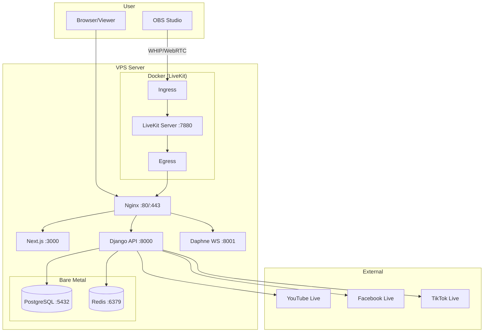

# MediaSite — Live Broadcasting & Guest Management Platform

[](LICENSE)
[](https://livekit.io)
[](https://djangoproject.com)
[](https://nextjs.org)

**MediaSite** is a full-featured live broadcasting and guest management platform. It's designed for podcasters, radio shows, and content creators who want to host remote guests via OBS Studio (WHIP/WebRTC), simulcast to YouTube/Facebook/TikTok, and manage their entire production workflow — all from one dashboard.

---

## ✨ Features

### 🎙️ Guest Broadcasting
- **OBS WHIP/WebRTC Ingress** — Guests join via browser (no software install needed)
- **Guest Queue System** — Director-controlled guest management
- **Auto-composition** — Picture-in-picture with host + guest + lower-thirds
- **Egress recording** — Save broadcasts to MP4 automatically
- **LiveKit-powered** — Sub-second latency, scalable WebRTC infrastructure

### 📡 Multi-Platform Simulcast
- Push to **YouTube Live**, **Facebook Live**, and **TikTok Live** simultaneously
- Per-platform RTMP management
- Stream health monitoring and auto-reconnect
- Guest RTMP egress for direct streaming

### 📅 Show Calendar & Blog
- Schedule shows with guest assignments
- Blog engine with comments, categories, and featured posts
- Public show listings and archives

### 👤 User Profiles
- Role-based: `host`, `guest`, `athlete`, `staff`, `admin`
- Bio, profile image, social links
- **Optional Sports Module** — Track athlete stats, drills, measurables (toggle on/off)

### 🔒 Security Built In
- COPPA age gate & parental consent (for under-13 users)
- Turnstile CAPTCHA on registration
- Rate-limited API endpoints
- Email verification flow
- JWT authentication

### 🤖 AI Assistant
- Avatar assistant for guest engagement
- Site-wide chat bot with FAQ management
- Conversation history and analytics

---

## 🏗️ Architecture



---

## 🚀 Quick Start

### Prerequisites
- Python 3.11+
- Node.js 20+
- PostgreSQL 14+
- Redis 7+
- Docker & Docker Compose (for LiveKit containers)

### 1. Clone & Setup

```bash
git clone https://github.com/docisit/itg-media-engine.git
cd media-site

# Backend
python -m venv .venv
source .venv/bin/activate
pip install -r requirements.txt

cp .env.example .env
# Edit .env with your settings

# Frontend
cd frontend
npm install
cp .env.example .env.local
# Edit .env.local with your settings
```

### 2. Database

```sql
CREATE DATABASE media_db;
CREATE USER youruser WITH PASSWORD 'yourpassword';
GRANT ALL PRIVILEGES ON DATABASE media_db TO youruser;
```

### 3. Run Migrations

```bash
cd backend
source ../.venv/bin/activate
python manage.py migrate
python manage.py createsuperuser
```

### 4. Start Development

```bash
# Terminal 1: Django
source .venv/bin/activate
python manage.py runserver 0.0.0.0:8000

# Terminal 2: Daphne (WebSockets)
source .venv/bin/activate
daphne -b 0.0.0.0 -p 8001 backend.asgi:application

# Terminal 3: Next.js
cd frontend
npm run dev
```

### 5. Start LiveKit (Docker)

```bash
# Follow the official LiveKit docs to set up docker-compose.yml
# https://docs.livekit.io/server/self-hosting/
docker compose up -d
```

### 6. Open in Browser
- **Frontend**: http://localhost:3000
- **API**: http://localhost:8000/api/
- **Admin**: http://localhost:8000/admin-hq2024/

---

## 🐳 Docker Deployment (Production)

For production, we recommend the full Docker Compose stack:

```bash
cd media-site
cp .env.example .env.docker
# Configure your production environment

docker compose up -d
```

### Using PM2 (alternative to Docker)

If you prefer bare-metal deployment with PM2, create an `ecosystem.config.js` file from the `.env.example` template and configure your services. See [SETUP.md](SETUP.md) for the full manual setup guide.

```bash
pm2 start ecosystem.config.js
pm2 save
pm2 startup
```

---

## ⚙️ Configuration

### Environment Variables

| Variable | Description | Default |
|----------|-------------|---------|
| `SECRET_KEY` | Django secret key | *(required)* |
| `DEBUG` | Debug mode | `False` |
| `ALLOWED_HOSTS` | Comma-separated hosts | `localhost,127.0.0.1` |
| `DATABASE_URL` | PostgreSQL connection | *(required)* |
| `REDIS_URL` | Redis connection | `redis://127.0.0.1:6379/0` |
| `LIVEKIT_API_KEY` | LiveKit API key | *(required for WebRTC)* |
| `LIVEKIT_API_SECRET` | LiveKit API secret | *(required for WebRTC)* |
| `LIVEKIT_URL` | LiveKit WebSocket URL | `wss://your-domain.com` |
| `TURNSTILE_SITE_KEY` | Cloudflare Turnstile key | *(optional)* |
| `FRONTEND_URL` | Frontend URL for CORS | `http://localhost:3000` |

### Feature Flags

| Flag | Description | Default |
|------|-------------|---------|
| `SPORTS_MODULE_ENABLED` | Enables athlete stats, drills, measurables | `False` |

Set `SPORTS_MODULE_ENABLED=True` in your `.env` to activate:
- Sport profiles with height/weight/measurables
- Drill library for coaches & athletes
- Stat tracking and leaderboards
- Verification videos

---

## 📂 Project Structure

```
media-site/
├── backend/              # Django REST API
│   ├── backend/          #   Settings, URLs, middleware
│   └── members/          #   Main app: models, views, serializers
├── frontend/             # Next.js 16 Application
│   └── src/              #   Pages, components, lib, types
├── agents/                 # LiveKit AI agents (Python)
├── docker/                 # Nginx Dockerfile & config
├── docker/nginx/           #   Reverse proxy config
├── docs/                   # Documentation
├── docker-compose.yml      # Production Docker stack
├── Dockerfile.django       # Django container build
├── Dockerfile.nextjs       # Next.js container build
└── SETUP.md                # Manual bare-metal setup guide
```

---

## 🔌 API Endpoints

| Category | Endpoints | Description |
|----------|-----------|-------------|
| **Auth** | `/api/token/`, `/api/register/` | JWT auth & registration |
| **Profiles** | `/api/profile/`, `/api/profiles/` | User profiles |
| **Shows** | `/api/shows/`, `/api/shows/live-status/` | Show calendar & live status |
| **Streaming** | `/api/streaming-status/`, `/api/streaming/whip-ingress/` | Stream management |
| **WebRTC** | `/api/webrtc/token/`, `/api/webrtc/ingress/` | LiveKit WebRTC tokens |
| **Blog** | `/api/blog/posts/`, `/api/blog/categories/` | Blog & comments |
| **Media** | `/api/media/`, `/api/media-assets/` | Media asset management |
| **Guest** | `/api/guest-requests/`, `/api/contact/` | Guest booking & contact |
| **Chat** | `/api/site-chat/ask/`, `/api/site-chat/config/` | AI chat assistant |
| **Avatar** | `/api/avatar/token/`, `/api/avatar/conversation/` | Avatar AI assistant |
| **Admin** | `/api/admin/profiles/`, `/api/admin/blog/` | Admin dashboard |
| **COPPA** | `/api/age-gate/check/`, `/api/age-gate/parent-consent/` | Child safety compliance |

> **Sports endpoints** (e.g., `/api/sports/`, `/api/drills/`, `/api/stats/`) are only registered when `SPORTS_MODULE_ENABLED=True`.

---

## 🔐 Security

- **JWT Authentication** with refresh tokens
- **Rate Limiting** on all public endpoints
- **Turnstile CAPTCHA** on registration
- **Email Verification** required for accounts
- **COPPA Compliance** — Age gate + parental consent flow
- **Content Reporting** — User flagging system
- **Admin IP Whitelist** — Restrict admin access by IP
- **Nginx** — Reverse proxy with SSL termination
- **Non-root containers** — All Docker containers run as unprivileged users

---

## 🤝 Contributing

1. Fork the repository
2. Create a feature branch (`git checkout -b feature/amazing-feature`)
3. Commit your changes (`git commit -m 'Add amazing feature'`)
4. Push to the branch (`git push origin feature/amazing-feature`)
5. Open a Pull Request

Please ensure your code passes all tests and linting before submitting.

---

## 📝 License

This project is licensed under the MIT License — see the [LICENSE](LICENSE) file for details.

---

## 🙏 Acknowledgments

- [LiveKit](https://livekit.io) — WebRTC infrastructure
- [Django REST Framework](https://www.django-rest-framework.org/) — API framework
- [Next.js](https://nextjs.org) — React framework
- [OBS Studio](https://obsproject.com) — Broadcasting software
- [Cloudflare Turnstile](https://www.cloudflare.com/products/turnstile/) — Bot protection

---

## 📬 Support

- [Open an issue](https://github.com/docisit/itg-media-engine/issues)
- [Discussions](https://github.com/docisit/itg-media-engine/discussions)

---

*Built with ❤️ for content creators everywhere.*
